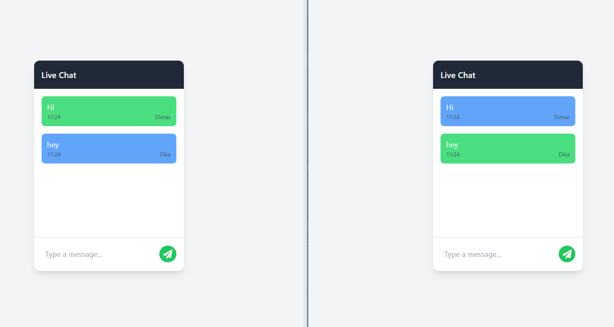

# Chat App With Socket.IO

This is a simple real-time chat application built with **Node.js** and **Socket.IO**. It allows multiple users to connect to a chat room and send messages in real-time.

## Home Page


## Features:

- Multiple users can join the chat room.
- Users can send and receive messages in real-time.
- The server uses **Socket.IO** to handle real-time communication between clients.
- The client sends and receives messages using **Socket.IO** in a **React TypeScript** frontend.

## Chat Page



## Technologies Used:

- **Node.js**
- **Socket.IO**
- **React**
- **TypeScript**
- **Vite**
- **Express**
- **Tailwind CSS**

## Folder Structure

The project is divided into two main directories:

### `client/`

This directory contains the frontend built with **React** and **Vite**. It handles the user interface and connects to the backend through **Socket.IO** for real-time messaging.

### `server/`

This directory contains the backend built with **Express**. It sets up the **Socket.IO** server, handles user connections, and manages real-time communication between clients.

## Installation:

### 1. Clone the repository:

```bash
git clone https://github.com/dimasrdika/chat_app_js.git
```

cd chat-app

### 2. Install dependencies For Server:

```bash
cd server
yarn install
```

### 3. Install dependencies For Client:

```bash
cd client
yarn install
```

### 4. Start the server:

```bash
cd server
yarn start
```

### 5. Start the client:

```bash
cd client
yarn dev
```

## Usage:

1. Open the client in your browser.
2. Enter a username and join the chat room.
3. Type and send messages in the chat box.
4. Disconnect from the chat room by closing the client window.
